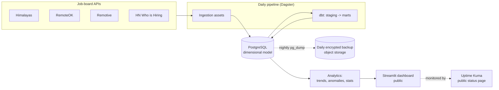

# MarketPulse

**Tech job-market intelligence pipeline.** Daily ingestion from multiple
remote-job boards, dimensional modeling in PostgreSQL, and a live public
dashboard tracking skill demand, salary trends, and posting-volume anomalies.

<!-- Replace OWNER once the CI badge URL is confirmed -->


- **Live dashboard:** _coming in week 2-3_
- **Status page (uptime):** _coming in week 2-3_

---

## The problem it solves

Engineers and hiring teams lack an honest, longitudinal view of the remote
tech job market: which skills are actually in demand, how compensation moves
over time, and when posting volume spikes or collapses. Point-in-time job
boards can't answer "is demand for this skill rising or falling?" because they
keep no history.

MarketPulse ingests job postings every day and accumulates that history, so the
questions above become answerable with real time series instead of guesses.

## Architecture



## Technical decisions and trade-offs

The reasoning behind the main choices (Dagster vs. Airflow, why dbt,
dimensional modeling, the single-VM resource budget, and the backup strategy)
lives in [`docs/architecture.md`](docs/architecture.md). It is written as the
decisions are made, not after the fact.

## Run it locally

Requirements: Python 3.12 and Docker.

```bash
# 1. Clone and enter the project
git clone git@github.com:jsmorac/marketpulse.git
cd marketpulse

# 2. Create the environment file from the template, then edit it
cp .env.example .env

# 3. Start PostgreSQL
docker compose up -d

# 4. Set up Python for development (lint + tests)
python -m venv venv
source venv/bin/activate          # Windows: .\venv\Scripts\activate
pip install -e ".[dev]"

# 5. Verify everything is green
ruff check .
pytest
```

## Roadmap

- **Phase 1 (current):** daily ingestion, dimensional model, public dashboard,
  24/7 uptime, automated encrypted backups.
- **Phase 2:** alerting on demand/salary thresholds (email/Telegram),
  anomaly detection on posting volume.
- **Phase 3:** richer statistical analysis (salary comparisons with
  significance tests), additional verticals.

## Data sources & attribution

Job data is provided by Himalayas, RemoteOK, Remotive, and Hacker News
("Who is Hiring"). Each source's terms of use require attribution with a direct
link; these attributions are rendered in the dashboard footer.

## License

[MIT](LICENSE)
