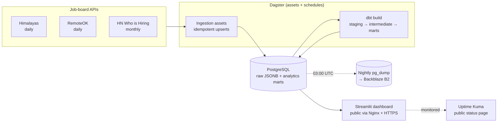

# MarketPulse

**Tech job-market intelligence pipeline.** Daily ingestion from multiple
remote-job boards, layered transformation with dbt, and a live public
dashboard tracking which technologies the market actually asks for — today,
cumulatively, and as a day-by-day trend.


- **Live dashboard:** https://techjobs.duckdns.org
- **Status page (uptime):** https://techjobs-status.duckdns.org/status/marketpulse

---

## The problem it solves

Engineers deciding what to learn — and teams deciding what to hire for — lack
an honest, longitudinal view of the remote tech job market. Point-in-time job
boards can't answer *"is demand for this skill rising or falling?"* because
they keep no history.

MarketPulse ingests job postings every day and accumulates that history in
PostgreSQL. The asset of this project is not the code — it's the growing
time series. That is why the pipeline runs 24/7 with public uptime monitoring
and daily off-site backups (restore-tested, not just taken).

## What the dashboard answers

- **Today:** which technologies appear in the latest snapshot, ranked.
- **Cumulative:** demand over the whole captured history, counting each
  posting exactly once (no inflation from postings that stay up for days).
- **Trend:** day-by-day time series per technology, plus a *movers* table
  (last 7 days vs. the prior 7) showing what's gaining and losing traction.
- **Tool vs. role vs. concept:** mentions are classified by `kind`, so
  "Python" (a tool you can learn) never competes in the same ranking as
  "Backend" (a role) or "Artificial Intelligence" (a concept).
- **Coverage honesty:** an explicit *other* bucket shows how much of the
  corpus the dictionary does **not** classify, audited against the real
  vocabulary of ~9,000 postings.

## Architecture


```mermaid
flowchart LR
    subgraph Sources["Job-board APIs"]
        HM[Himalayas<br/>daily]
        RO[RemoteOK<br/>daily]
        HN[HN Who is Hiring<br/>monthly]
    end

    subgraph Dagster["Dagster (assets + schedules)"]
        ING[Ingestion assets<br/>idempotent upserts]
        DBT[dbt build<br/>staging → intermediate → marts]
    end

    PG[(PostgreSQL<br/>raw JSONB + analytics marts)]
    DASH[Streamlit dashboard<br/>public via Nginx + HTTPS]
    BK[(Nightly pg_dump<br/>→ Backblaze B2)]
    UK[Uptime Kuma<br/>public status page]

    Sources --> ING --> PG
    PG --> DBT --> PG
    PG --> DASH
    PG -. 03:00 UTC .-> BK
    DASH -. monitored .-> UK
```

**Data flow (ELT):** each source lands as a complete raw JSON payload
(`raw.*`, one table per source, `JSONB` column). dbt then unpacks, unifies and
aggregates: per-source staging views normalize naming so downstream models
don't know or care where a posting came from; a single intermediate model
matches postings against a curated technology dictionary; marts serve the
dashboard. Third-party APIs change their fields without notice — storing the
raw payload means a schema change never loses a day of data.

## Technical decisions and trade-offs

Full reasoning lives in [`docs/architecture.md`](docs/architecture.md),
written as decisions were made, not after the fact. Highlights:

- **Dagster over Airflow** — lighter on a single VM, asset-centric model
  (each asset = a piece of data plus the recipe to produce it), and the
  concepts transfer (DAGs, schedules, backfills, idempotency).
- **Raw JSONB + dbt over typed ingestion** — ingestion does minimal cleaning;
  all normalization is SQL in dbt, versioned and testable (`dbt build`
  runs seed → run → test on every pipeline run).
- **Idempotent loads** — `INSERT ... ON CONFLICT (source_job_id,
  snapshot_date) DO UPDATE`. Re-running a day never duplicates history.
- **HN is monthly, not daily — by design.** The "Who is Hiring" thread is
  static: re-ingesting it daily under a new snapshot date inflated counts
  15–30×. Detected in production, fixed by moving HN to a monthly schedule
  that runs after the thread's initial burst settles.
- **Word-boundary matching, not substrings.** The first matcher used
  `ILIKE '%keyword%'` and produced false positives (Java → Java*Script*,
  AI → em*ai*l). The current matcher normalizes separators and matches whole
  words against a 92-alias dictionary.
- **Single-VM resource budget** — everything runs on one ARM VM (2 OCPU /
  12 GB). Postgres, Dagster, Streamlit and Uptime Kuma run 24/7; the design
  favors boring, low-memory choices over horizontally-scalable ones the
  project doesn't need.

## Operations & hardening

- **Backups:** nightly `pg_dump` → gzip → Backblaze B2 (private bucket,
  scoped application key). The restore path is tested against a throwaway
  Postgres container and verified row-by-row against production — a backup
  that has never been restored is not a backup.
- **Network surface:** only Nginx (80/443, TLS via certbot) is exposed.
  Postgres, Dagster, Streamlit and Uptime Kuma all bind to `127.0.0.1`;
  Dagster's UI is reachable only through an SSH tunnel.
- **Observability:** ingestion assets log through Dagster's structured
  logger (per-run, per-asset), and the public status page tracks dashboard
  uptime continuously.
- **CI:** ruff (lint + format) and pytest on every push, from the first
  commit.

## Run it locally

The only requirement is **Docker** — every command runs inside the project's
containers (Python 3.12, pinned dependencies), so nothing needs to be
installed on your host. This flow is verified end-to-end from a fresh clone.

```bash
# 1. Clone and enter the project
git clone https://github.com/jsmorac/marketpulse.git
cd marketpulse

# 2. Create the environment file from the template, then edit passwords
cp .env.example .env
#    For a fully containerized run, keep DB_HOST=postgres and DB_PORT=5432
#    (containers talk to each other over Docker's internal network).

# 3. Build and start the full stack
docker compose up -d --build

# 4. Apply schema migrations (creates the raw.* tables)
docker compose run --rm dagster-webserver alembic upgrade head

# 5. Run the pipeline once — open the Dagster UI at localhost:3000,
#    materialize the ingestion assets, then dbt_build

# 6. Dashboard is already up → http://localhost:8501

# Verify everything is green
docker compose run --rm dagster-webserver python -m ruff check .
docker compose run --rm dagster-webserver python -m pytest
```

> **Note:** service and container names are fixed in `docker-compose.yml`,
> so running a second copy of the project on the same machine requires a
> `docker-compose.override.yml` remapping `container_name` and published
> ports. This doesn't affect the normal single-instance setup.

## Roadmap

- **Phase 1 (done):** daily ingestion from 3 sources, dbt-layered model with
  a `kind` dimension, public dashboard (today / cumulative / trend / movers),
  24/7 uptime with public status page, tested off-site backups.
- **Phase 2:** filter non-tech postings at ingestion (the audited *other*
  bucket is mostly HR/legal jargon and non-technical roles, not missing
  technologies); relative-share view (% of daily volume) alongside absolute
  counts.
- **Phase 3:** alerting on demand thresholds (email/Telegram), posting-volume
  anomaly detection, salary analysis where sources provide it.

## Data sources & attribution

Job data is provided by [Himalayas](https://himalayas.app),
[RemoteOK](https://remoteok.com) and Hacker News
(["Who is Hiring"](https://news.ycombinator.com/submitted?id=whoishiring)).
Each source's terms require attribution with a direct link; attributions are
rendered in the dashboard.

## License

[MIT](LICENSE)
