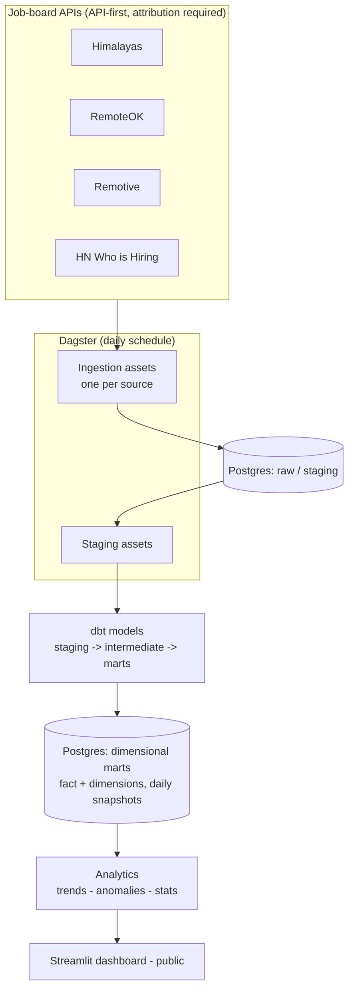

# Architecture & technical decisions

This document records the *why* behind each major choice, written as the
decisions are made. It doubles as pre-written interview material.

## System diagram

## Decisions

### Why Dagster over Airflow

Airflow is the better-known name, but it is heavy for a single small VM and its
scheduler/worker model carries operational overhead we don't need. Dagster is
lighter to run, has a cleaner asset-based model, and the core concepts transfer
directly to Airflow (DAGs, scheduling, backfills, idempotency) if a future
employer uses it. Trade-off accepted: a slightly less ubiquitous tool in
exchange for lower resource use and a better developer experience on a
constrained box.

### Why dbt for transformations

dbt keeps transformations as version-controlled, tested SQL with clear lineage
(staging -> intermediate -> marts), instead of ad-hoc scripts. It also closes a
commonly-requested stack gap: Dagster + dbt + Postgres is a standard modern
data-engineering combination.

### Dimensional modeling

The marts use a fact table plus dimensions, with daily snapshots to preserve
history. This is what makes "is demand for this skill rising?" answerable: the
value of the project is the accumulated history, not any single day's data.

### Single-VM resource budget

The VM has 12 GB RAM. MarketPulse runs 24/7 because its selling point depends on
continuous uptime; the other portfolio projects run on demand to stay within
the budget. Dagster runs in a lightweight mode. This is a deliberate
constraint-driven choice, documented rather than hidden.

### Backups (the real asset)

The code lives in Git, but the *accumulated history* lives only in Postgres. A
nightly `pg_dump`, encrypted and pushed to external object storage, is set up
from week 1 — not later — and the restore is tested at least once. An untested
backup is not a backup.

## Source terms of use

All four sources require attribution with a direct link. Attribution strings
are centralized in `ingestion/sources.py` and surfaced in the dashboard footer
and the README.
